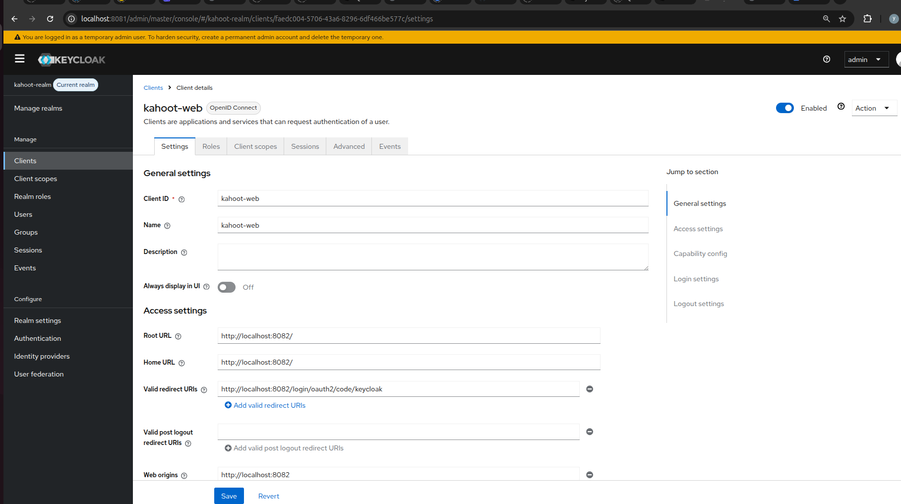
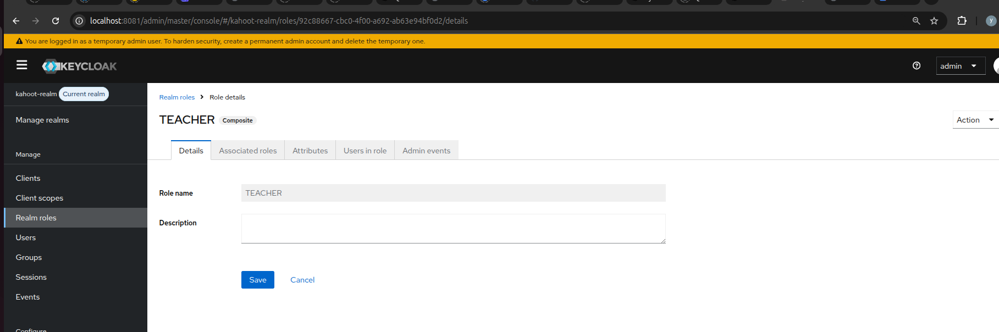
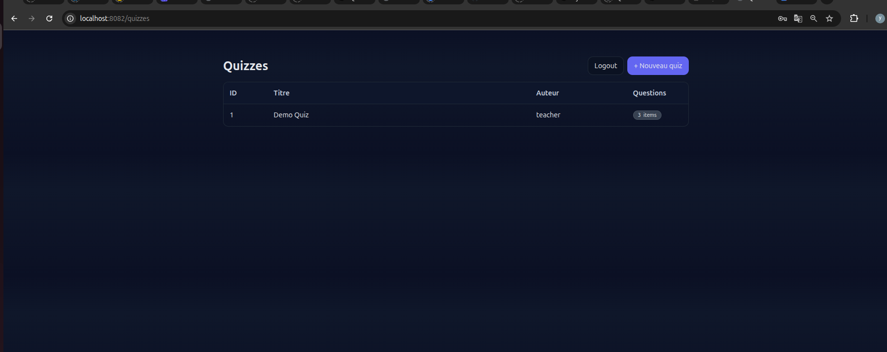
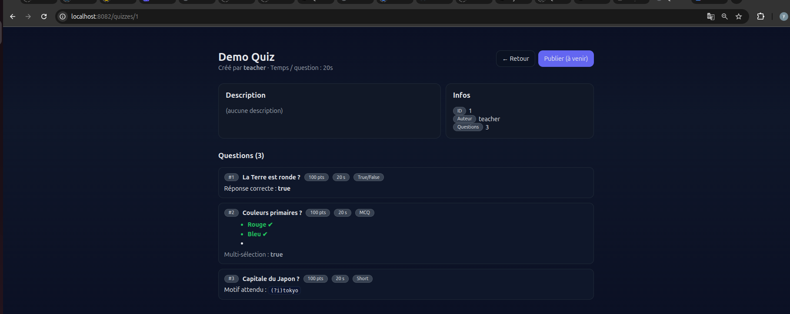
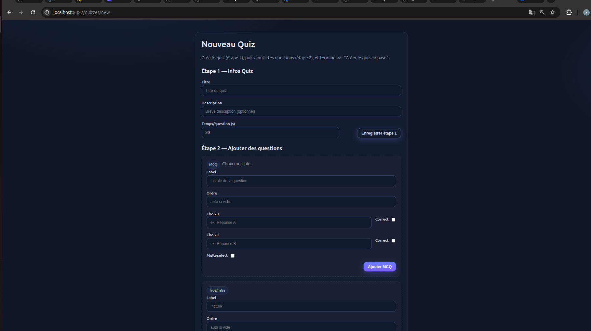

# TP3–TP4 : Auth OIDC + Autorisations (Keycloak + Spring Security)

## Objectif
Intégrer une authentification OAuth2/OpenID Connect via **Keycloak** dans l’appli Spring Boot, puis contrôler l’accès aux pages et APIs selon des rôles.
- **TP3** → SSO OIDC
- **TP4** → Autorisations fines par rôles

---

## Ce qui a été fait

### TP3 — SSO OIDC
- Realm dédié et **client public** `kahoot-web`.
- Login OIDC avec **PKCE S256** et redirection vers Keycloak.
- Récupération des **claims** (preferred_username, email, …).
- Retour vers `/login/oauth2/code/keycloak`, puis redirection **/quizzes**.

<p align="center">
  
</p>

### TP4 — Autorisations par rôles
- Création des **realm roles** : `TEACHER`, `PLAYER`.
- Ajout du **client scope** `roles` au client `kahoot-web` (rôles injectés dans le token).
- Règles d’accès principales :

| Ressource/Route                 | Accès |
|---------------------------------|------:|
| `/`, assets statiques, H2 (dev) | public |
| `/quizzes/**`, `/api/quizzes/**`| `PLAYER` **ou** `TEACHER` |
| `/api/admin/**`                 | `TEACHER` uniquement |

- Logout OIDC avec redirection post-logout vers `/quizzes`.

<p align="center">
  
</p>

---

## Comment on l’a fait (essentiel)

### 1) Côté Keycloak
- **Client** `kahoot-web` (OpenID Connect, **Public**).
    - Root/Home: `http://localhost:8082/`
    - **Redirect URIs**: `http://localhost:8082/login/oauth2/code/*`
    - **Web origins**: `http://localhost:8082`
- **Capabilities**: *Standard Flow* ✅
- **Client scopes assignés**: `roles` (Default), `web-origins` (Default)
- **Realm roles**: création de `TEACHER`, `PLAYER` et affectation aux comptes de test.

### 2) Côté Spring Security
- Activation du **login OAuth2/OIDC** et du **logout OIDC**.
- Définition des règles d’autorisation (selon les rôles ci-dessus).
- Tolérances dev pour H2 (CSRF ignoré + `frameOptions().sameOrigin()`).
- **Success handler** → redirection vers `/quizzes`.

### 3) Flux utilisateur
1. L’utilisateur visite `/quizzes` → redirection Keycloak.
2. Il se connecte (PKCE) → retour à l’app avec un code.
3. L’app échange le code contre un **ID Token/Access Token** → session établie → `/quizzes`.


---

## Aperçu de l’application

**Liste des quizzes**

<p align="center">
  
</p>

**Détail d’un quiz**

<p align="center">
  
</p>

**Création d’un quiz**

<p align="center">
  
</p>

---

## Notes techniques
- Le scope `roles` est nécessaire pour que Keycloak **mette les rôles dans le token** consommé par Spring Security.
- Le client `kahoot-web` est **public** → auth au token endpoint via PKCE (pas de client secret).
- Les rôles utilisés pour `authorizeHttpRequests` proviennent du token OIDC (via `GrantedAuthorities`).

## Environnement Keycloak (Docker)

Nous avons lancé Keycloak en **mode dev** via l’image officielle et l’avons exposé sur **8081** (mappé vers 8080 du conteneur) :

```bash
docker run -p 8081:8080 \
  -e KEYCLOAK_ADMIN=admin \
  -e KEYCLOAK_ADMIN_PASSWORD=admin \
  quay.io/keycloak/keycloak:latest start-dev